# LeetBoard Chrome Extension


LeetBoard is a Chrome extension that allows users to track their LeetCode progress and collaborate with friends. This repository contains the source code for the extension and its configuration.

## Table of Contents

1. [Prerequisites](#prerequisites)
2. [Installation](#installation)
3. [Webpack Configuration](#webpack-configuration)
4. [Extension Code](#extension-code)
5. [Firebase Integration](#firebase-integration)
6. [Contributing](#contributing)
7. [Contact](#contact)
8. [License](#license)

## Prerequisites

Before you begin, make sure you have the following tools installed on your machine:

- Node.js
- npm
- Firebase account for Firebase configuration

## Installation

Follow these steps to set up the project locally:

1. Clone the Repository

First, clone the repository to your local machine:

```bash
git clone https://github.com/your-username/leetboard.git
cd leetboard
```

2. Install Dependencies

Install the required npm packages:

```bash
npm install
```

3. Firebase Setup

In order to set up Firebase for the extension, follow these steps:

- Go to [Firebase Console](https://console.firebase.google.com/).
- Create a new Firebase project.
- After you have created your project, add a new Web App to your Firebase project, by clicking on code icon, found on Project Overview tab of Firebase console.
  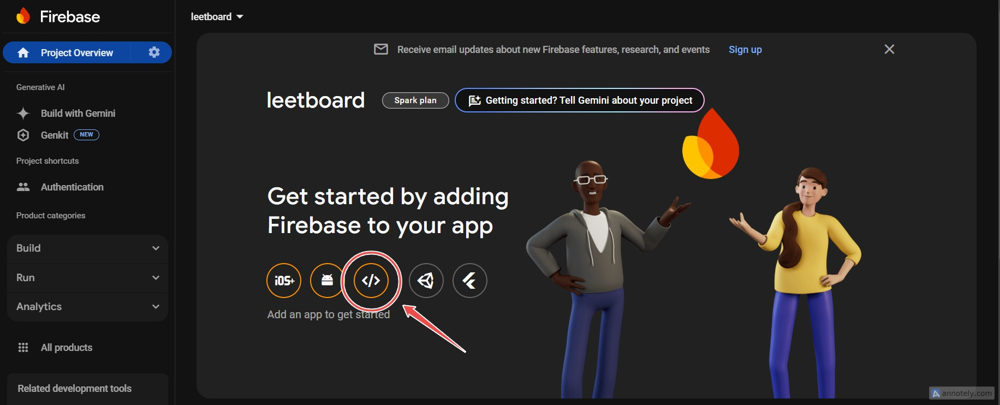

  Then on first field add app's nickname and click on register app:

  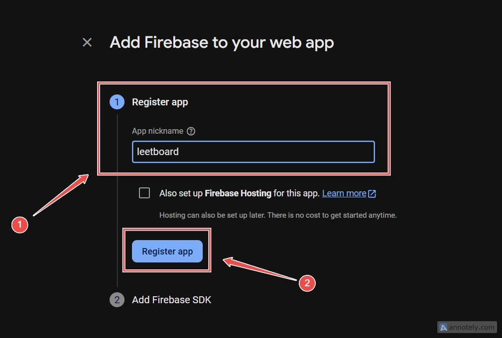

- Open your code editor and create a `.env` file and add the following env variables, provided by Firebase.

```bash
  API_KEY_LOCAL="<YOUR-API-KEY>"
  AUTH_DOMAIN="<YOUR-AUTH-DOMAIN>"
  PROJECT_ID="<YOUR-PROJECT-ID>"
  STORAGE_BUCKET="<YOUR-STORAGE-BUCKET>"
  MESSAGING_SENDER_ID="<YOUR-MESSAGING-SENDER-ID>"
  APP_ID="<YOUR-APP-ID>"
```

- Enable Authentication and select Google as a sign-in method. On Project Overview tab, scroll down to find _Authentication_ section.
  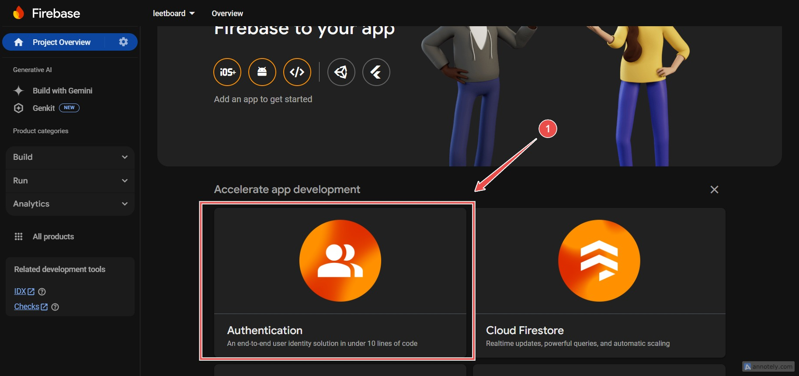

  Then, click on _Get Started_ button:
  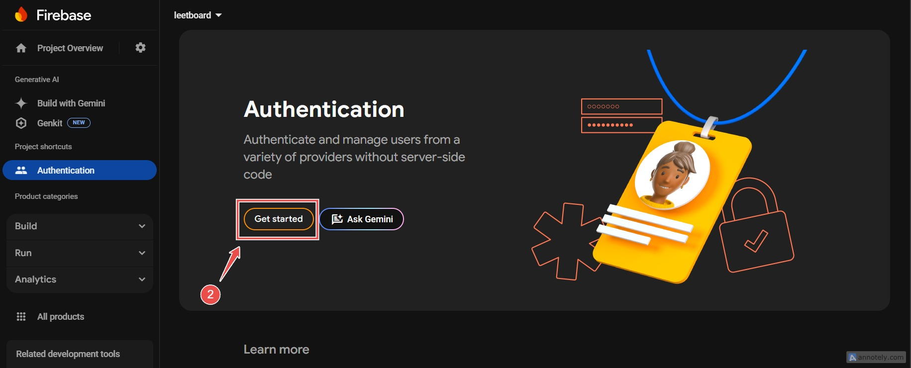

  On _Sign-in method_ tab of Authentication section, choose Google:
  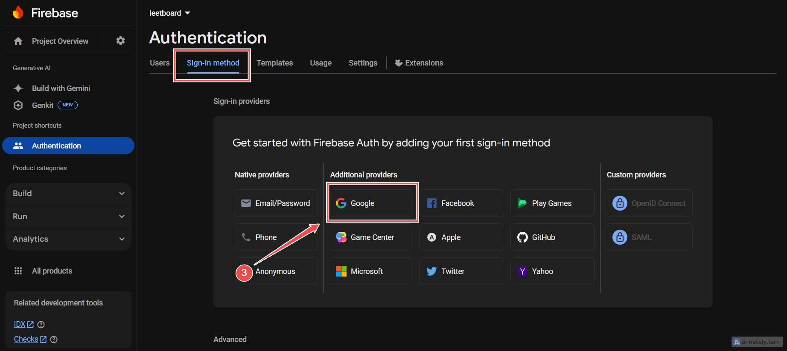

  Click _Enable_:
  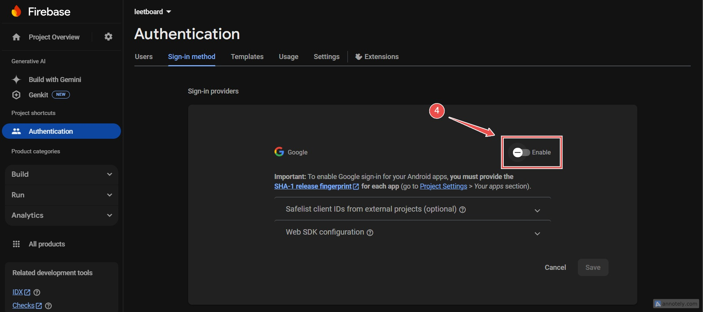

  Fill in project name, click on dropdown to select your gmail account and hit _Save_:
  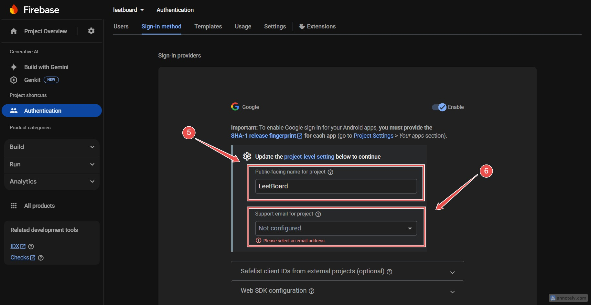

4. Set Up Google Cloud Console

- Go to [Google Cloud Console](https://console.cloud.google.com/).
- On header of Google Cloud Console, click on _Select Project_. and select your lately created Firebase project. Make sure it has the same _PROJECT_ID_, as the one on `.env` file.
  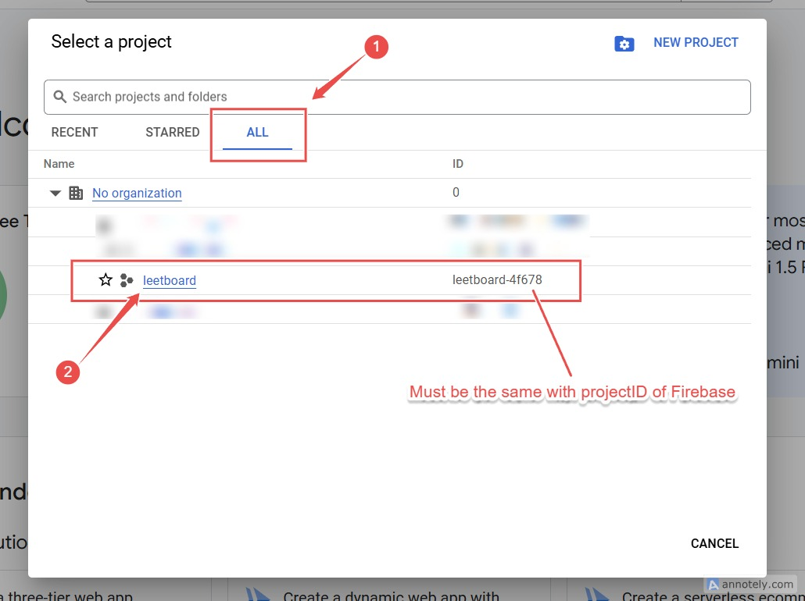
- Then, open the navigation menu (on top left corner), locate _API & Services_ and click on _Credentials_.
  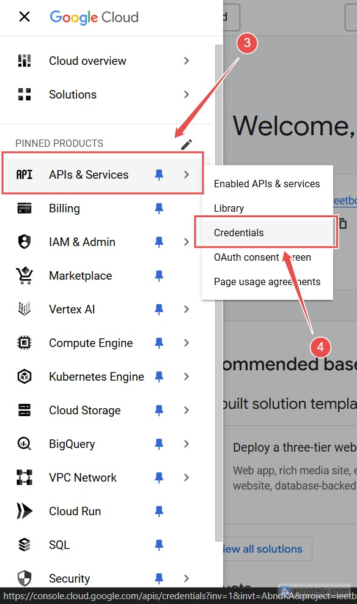
- Locate OAuth 2.0 Client IDs and copy Client ID.
- Open `manifest.json` file and paste the Client ID on oauth2.client_id.
  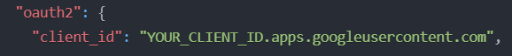
- Open your code editor and on project's root folder run the following command to start webpack on development server:

```bash
npm run build
```

- On Chrome, navigate to `chrome://extensions`, enable _Developer Mode_, click _Load Unpacked_ on top left corner and select **dist** folder.
- Once the extension is loaded copy _Extension ID_.
- Navigate back to Google Cloud Console and click _Create Credentials_ and then OAuth client ID.
  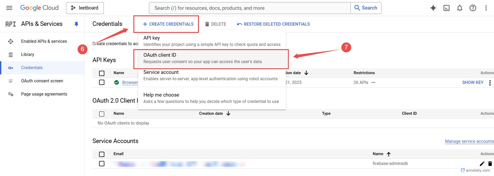
- On _Application Type_ dropdown, select _Chrome Extension_. On _Name_ input field add the name of the extension 'LeetBoard'. At item ID field paste the _Extension ID_.
  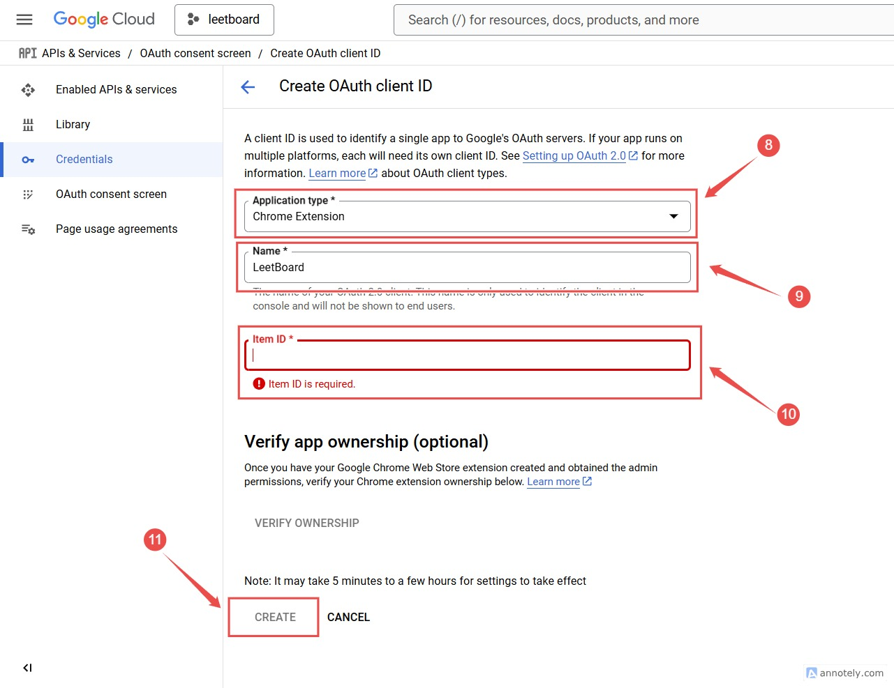
- After successful creation, Google Cloud Console will prompt you an updated _Client ID_, copy and paste it on `manifest.json` at oauth2.client_id.

## Webpack Configuration

The project uses Webpack for bundling. There are three main Webpack configuration files:

- webpack.development.js: Used for development purposes. Configure this script to suit your development needs. Run the following command to build the development version of the extension:

```bash
npm run build
```

- webpack.production.js: Used for the production release. Configure this script to prepare your extension for release. Run the following command to build the production version:

```bash
  npm run release
```

- webpack.common.js: This file contains the common bundler configurations shared between both development and production scripts.

## Extension Code

All the extension's development code should be placed in the **src/** folder. This includes:

- The manifest.json file should also be in the src folder.
- Any JavaScript, CSS, or assets for the extension should be placed in the appropriate directories within the src folder.

## Firebase Integration

Firebase is used for backend services such as authentication and data storage. Ensure that you have set up Firebase correctly and are importing and using the firebaseApp as shown above.

## Contributing

To contribute to this project, follow these steps:

1. Fork this repo.
   Click the "Fork" button at the top-right corner of this repository to create a copy in your GitHub account.

2. Clone the forked repo to your local machine.

```bash
git clone https://github.com/your-username/leetboard.git
cd leetboard
```

3. Create a new branch and switch to it.

```bash
git switch -c your-branch-name
```

4. Make the necessary changes and commit them.

```bash
git add .
git commit -m "Your commit message"
```

5. Push your changes to your forked repo.

```bash
git push -u origin your-branch-name
```

6. Submit a pull request.

- Navigate to your repo on GitHub.
- Click the "Compare & pull request" button.
- Provide a clear and detailed description of your changes in the PR template.
- Link any related issues if applicable (e.g., "Fixes #123").

**IMPORTANT**: We welcome contributions to **LeetBoard**! Before contributing, please follow these steps:

1. **Join our [Discord Server](https://discord.gg/KmhtPxg5Tb)**

   - Once you're in the server, introduce yourself and have a quick chat with me (the project owner).

2. **Discuss Your Changes**

   - We’ll go over the Contributor Guidelines and make sure we’re on the same page regarding your proposed changes.

3. **Make Your Pull Request**
   - After discussing your changes and getting the green light, feel free to submit your pull request.

This helps us ensure that your contributions are aligned with the project and maintain its quality.

## Contact

For any inquiries, please contact stevealdrin7@gmail.com.

## License

LeetBoard is dual-licensed under the **AGPL-3.0 License** and a **Commercial License**.

For more information refer the License file.
